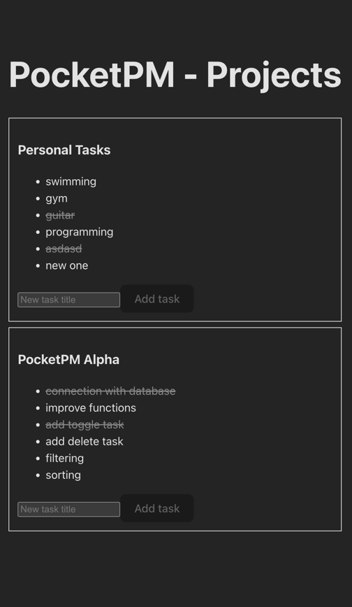

# PocketPM Web

A small React (Vite) web app for managing projects and tasks.

The goal of this README is to provide quick setup and run instructions.

---

## Tech stack

- React 19
- TypeScript
- Vite
- TanStack React Query

---

## Requirements

- Node.js (recommended: latest LTS)
- npm

---

## Installation

- Clone the repository
- Install dependencies

```bash
 npm install
```

---

## Backend API (required for full app)

For the full application to work, you also need to run the backend repository: `pocketpm-api`.

- This frontend app depends on the API being available (running locally or deployed).
- Setup details (including `DATABASE_URL`, Prisma generate/migrations, and how to run the API) are described in the `pocketpm-api` repository README.

In short:

- clone and run `pocketpm-api` in parallel with this app
- follow the backend README for configuration and startup steps

### URL:

- https://github.com/dariuszS93/pocketpm-api

---

## Running locally

### Dev server

```bash
 npm run dev
```

### Build for production

```bash
 npm run build
```

### Preview production build

```bash
 npm run preview
```

### Lint

```bash
 npm run lint
```

### Format (if configured)

```bash
 npm run format
```

---

## Configuration (optional)

### Environment variables (Vite)

If the app uses an API base URL, configure it via Vite env variables.

1. Create file: `.env.local`
2. Add variables, for example:

```bash
VITE_API_BASE_URL=http://localhost:3000
```

Then read them in code using:

- `import.meta.env.VITE_API_BASE_URL`

Note:

- If you do not use env vars yet, you can skip this section

---

## License

This repository is proprietary and not open source.

You may not copy, modify, distribute, or use this code without explicit written permission from the author.  
See: `LICENSE`.

---

## Screenshot

Place your screenshot in the repo, for example:

- `docs/screenshot.png`

Then reference it here:  

